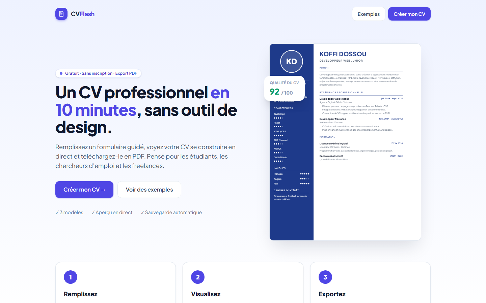
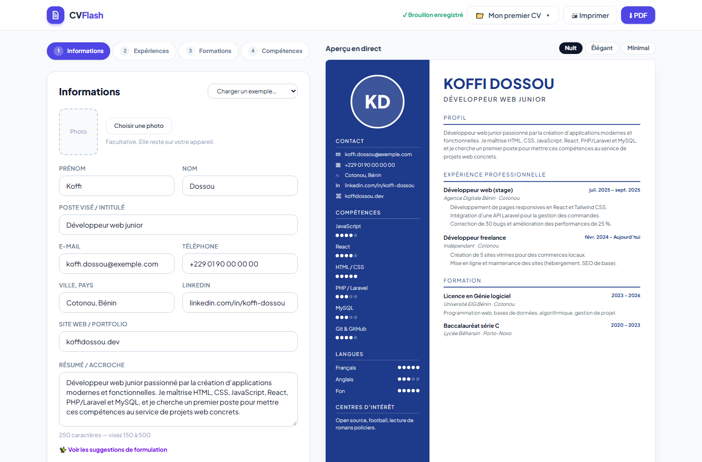

# CVFlash — Générateur de CV en ligne

Outil qui permet de saisir ses informations dans un formulaire guidé et de générer un CV soigné, prêt à
télécharger en PDF, à partir de trois modèles. Projet n°2 du cahier des charges « 9 projets fictifs ».

**Démo en ligne :** https://cvflash.vercel.app




## Fonctionnalités (MVP)

- Formulaire multi-étapes : informations personnelles, expériences, formations, compétences et langues
- Aperçu en temps réel du CV pendant la saisie, avec repères de pages A4
- Trois modèles de mise en page : **Nuit**, **Élégant**, **Minimal** (compatible ATS) et couleur au choix
- Export PDF : téléchargement direct (jsPDF) ou impression navigateur (PDF avec texte sélectionnable)
- Sauvegarde locale automatique du brouillon (LocalStorage)

## Fonctionnalités avancées (bonus)

- Plusieurs CV enregistrés (créer, renommer, dupliquer, supprimer)
- Partage par lien public en lecture seule (les données sont encodées dans l’adresse, sans serveur)
- Indicateur de qualité sur 100 : longueur du résumé, expériences détaillées, résultats chiffrés, verbes d’action, sections manquantes
- Suggestions de formulation (phrases d’accroche et puces d’expérience) à insérer en un clic
- Photo facultative redimensionnée dans le navigateur ; validation des champs avec react-hook-form

> Non réalisés : comptes utilisateurs côté serveur (Laravel + Sanctum, marqué « option » dans le cahier des
> charges) et suggestions par l’API Claude (nécessiterait une clé secrète côté serveur).

## Stack

React 19 · Vite · Tailwind CSS 4 · react-hook-form · jsPDF + html2canvas-pro · React Router

## CV d’exemple

Trois CV fictifs exportés en PDF : [`docs/exemples/`](docs/exemples).

## Lancer le projet

```bash
npm install
npm run dev
npm run build
```

Auteur : [Sedjame Vianney](https://sedjame-vianney.vercel.app)
